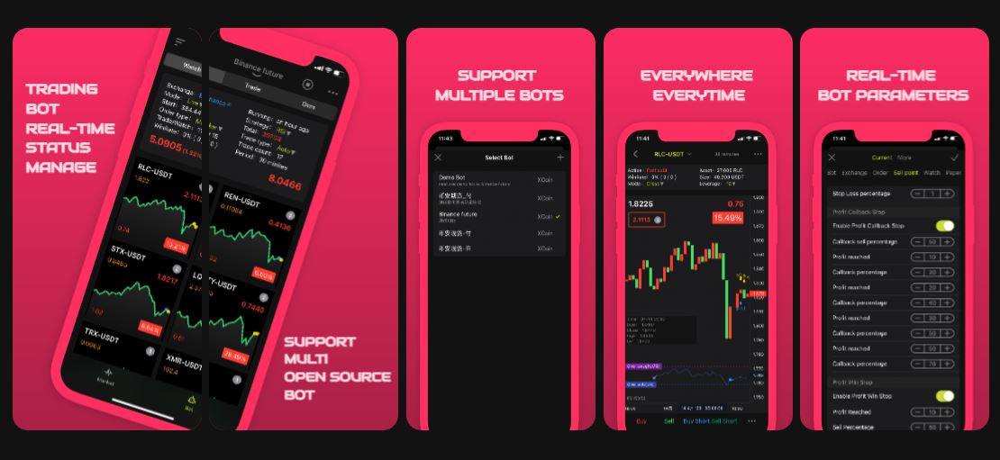

<p align="center"></p>

<h1 align="center">Panacea</h1>

<h4 align="center">Trading Bot Real-time Status Manager</h4>

**Manage your trading bot anytime anywhere**

> server side: XCoin,freqtrade,Zenbot or your own bot.
>
> client side: Android,Ios,Web,Linux, macOS and Windows.

## Screenshots

### Desktop


### Mobile



## Features

-Support multiple open source trading bot or commercial trading bot
-Support all platform(android,ios,web,windows,mac,linux)
-Support  multiple trading bot manage.
-Support real-time trading, long short trading.
-Support real-time modification of bot configuration.
-Support real-time modification of bot strategies.

## Install

### Application

Download application from the official website according to your needs [Desktop](https://www.ciiat.com/download) or [Mobile](https://www.ciiat.com/download)

### Developer

```bash
git clone https://github.com/markmind/panacea-api.git
```

## Document

You can use or participate in development through the Panacea user documentation and developer documentation

- [User Document](docs/README.md)

- [Developer](docs/developer.md)

If you have problems and bugs, please submit them through Github, We will try our best to answer your questions in time. Of course, it would be greatly appreciated if you could submit a PR directly.

You can click here to view the [中文](README.zh-CN.md) document

## Contributors

Thanks to all contributors [[contributors](https://github.com/markmind/panacea-api/graphs/contributors)] who participated to Panacea project.

## License

[**MIT**](https://opensource.org/licenses/MIT).
